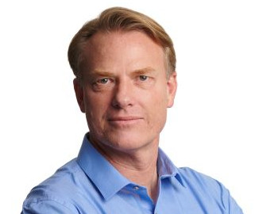

# AI Projects Portfolio

## Summary
I am passionate about creating products and bringing them to market.  AI helps accelerate that journey.

### AI Projects
+ RAG: [Gutenberg Library AI Query Tool](https://gutenberg.streamlit.app/) A Retrieval Augmented Generation(RAG) tool that allows you to query books from the Gutenberg library that were not included in the ChatGPT-3.5-Turbo model. Built using Python and deployed with Streamlit. [Code](https://gutenberg.streamlit.app/)
+ [Chatbot Front End](https://appchatpy-lg3uuisgagqdcuik8wgkfg.streamlit.app/) A simplified front end for generative chatbots.
+ No Code/Text Input tool that allows users to generate Javascript games using only text input.  Built with Python and Streamlit.
+ Image Classification using Convoluted Neural Network(CNN) fine-tuned with Tensorflow

### AI Articles
+ [Introduction to AI Chatbots ](https://www.linkedin.com/pulse/introduction-how-ai-modular-chatbots-work-part-1-ward-greunke-q4xqc)
  + [Part 2 - Tools/Memory/Implementation](https://www.linkedin.com/pulse/introduction-components-ai-chat-application-part-2-ward-greunke-c94sc)
+ [How to query SQL data using AI](https://www.linkedin.com/pulse/how-query-your-sql-data-ai-ward-greunke-l6zoc/?trackingId=Zq4mBIXgQAqtjaMPpLPkEQ%3D%3D)
+ [How to explain neural networks to a 5 year old](https://www.linkedin.com/pulse/want-understand-how-neural-networks-work-just-ask-friend-ward-greunke-abngc)
+ [Difference between RAG and Fine Tuning](https://www.linkedin.com/feed/update/urn:li:linkedInArticle:7179593602287763456/)

### Additional Projects
[GreekGraph](https://www.greekgraph.com)- An option trading strategey visualization tool.

## My Pages
- [Github Repository](https://github.com/wgreunke)
- [LinkedIn Profile](https://www.linkedin.com/in/wgreunke/)
